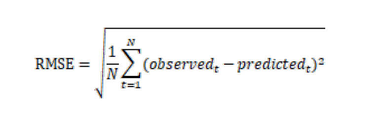
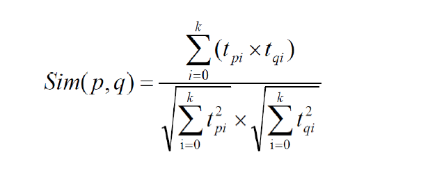
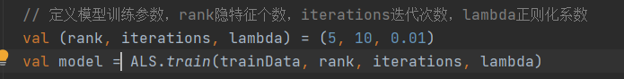
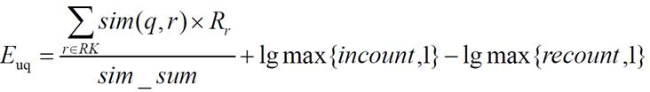
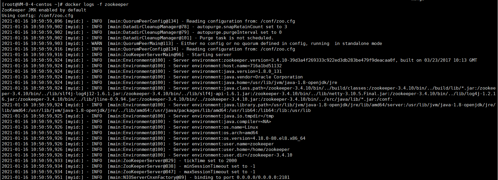
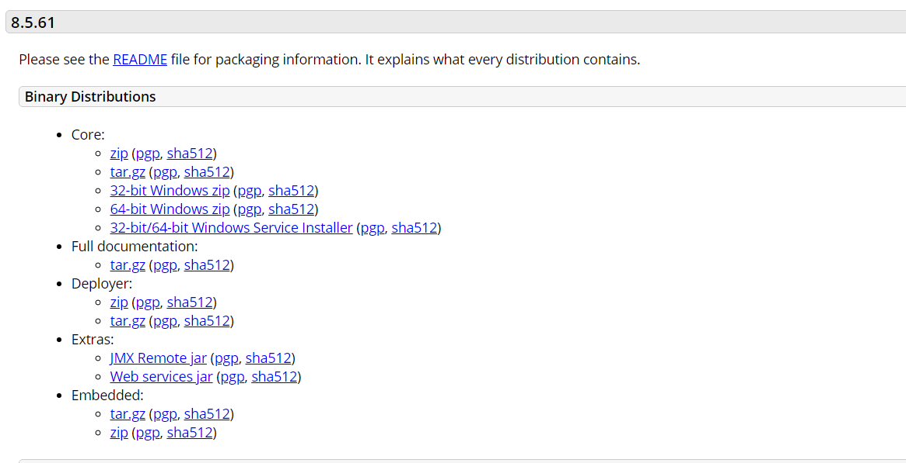
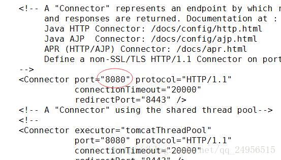

# ECommerce-Recommend-System
ECommerce Recommend System

## 算法笔记

### 统计推荐

主要就是通过spark.sql使用查询语句进行排行的

#### 历史热门商品推荐

根据评价次数进行排行

#### 近期热门

按月进行热门热门商品推荐

#### 平均评分成绩排行

对通过商品的评分取均值进行排行

### 离线推荐

#### ALS算法

隐语义模型是一种比较常用的协同过滤算法，基本思想是对稀疏矩阵进行模型分解，评估出缺失项的值，以此来得到一个基本的训练模型。然后依照此模型可以针对新的用户和物品数据进行评估。ALS是采用交替的最小二乘法来算出缺失项的。交替的最小二乘法是在最小二乘法的基础上发展而来的。

协同过滤算法，用户特征，商品特征，推荐

##### 模型评估和参数选取

###### 均方根误差




#### 特征向量



tpi 商品p的特征向量， tqi商品q的特征向量

基于商品的特征向量，计算商品的相似度，进行推荐



### 实时推荐

背景：用户对产品的偏好随时间的推移总是会改变

要求：

1. 用户评分后或者最近几次评分后系统可以更新推荐结果

2. 计算快，准确率可适当降低

推荐算法公式：



Rr表示用户u 对商品r 的评分；

sim(q,r)表示商品q 与商品r 的相似度，设定最小相似度为0.6，当商品q和商品r 相似度低于0.6 的阈值，则视为两者不相关并忽略；

sim_sum 表示q 与RK 中商品相似度大于最小阈值的个数；

incount 表示RK 中与商品q 相似的、且本身评分较高（>=3）的商品个数；

recount 表示RK 中与商品q 相似的、且本身评分较低（<3）的商品个数；


公式前部分：对于每个候选商品q，从u 最近的K 个评分中，找出与q 相似度较高（>=0.6）的u 已评分商品们（复用离线的相似表），对于这些商品们中的每个商品r，将r 与q 的相似度乘以用户u 对r 的评分，将这些乘积计算平均数，作为用户u 对商品q 的评分预测

后半部分（奖惩因子）：

incount：跟候选商品q相似且评分大于某一阈值（>=3)的个数

与候选商品q的相似度越高还评分越高的，我们应该更大力度的推荐，优先级更高。

### 更多

UserCF：推荐那些和他有共同兴趣爱好的用户喜欢的物品

ItemCF：推荐那些和他之前喜欢的物品类似的物品

结合深度学习算法，神经网络相关算法

## 基于Docker环境下部署

### 环境

- 日志管理工具log4j
- 日志采集服务Flume-ng
- 消息缓冲服务 kafka
- 实时推荐服务 sparkstreaming

- 业务数据库mongodb，nosql文档行数据库
- 缓存数据库redis，缓存数据库
- Azkaban自动化调度

### Docker环境安装

- 安装`yum-utils`：

```bash
yum install -y yum-utils device-mapper-persistent-data lvm2Copy to clipboardErrorCopied
```

- 为yum源添加docker仓库位置：

```bash
yum-config-manager --add-repo https://download.docker.com/linux/centos/docker-ce.repoCopy to clipboardErrorCopied
```

- 安装docker：

```bash
yum install docker-ceCopy to clipboardErrorCopied
```

- 启动docker：

```bash
systemctl start dockerCo
```

### Mysql

- 下载MySQL8.0的docker镜像：

```
docker pull mysql:8.0
```

- 使用如下命令启动MySQL服务：

```
docker run -p 3306:3306 --name mysql \
-v /mydata/mysql/log:/var/log/mysql \
-v /mydata/mysql/data:/var/lib/mysql \
-v /mydata/mysql/conf:/etc/mysql \
-e MYSQL_ROOT_PASSWORD=root  \
-d mysql:8.0
```

- 参数说明
  - -p 3306:3306：将容器的3306端口映射到主机的3306端口
  - -v /mydata/mysql/conf:/etc/mysql：将配置文件夹挂在到主机
  - -v /mydata/mysql/log:/var/log/mysql：将日志文件夹挂载到主机
  - -v /mydata/mysql/data:/var/lib/mysql/：将数据文件夹挂载到主机
  - -e MYSQL_ROOT_PASSWORD=root：初始化root用户的密码
- 进入运行MySQL的docker容器：

```bash
docker exec -it mysql /bin/bashCopy to clipboardErrorCopied
```

- 使用MySQL命令打开客户端：

```bash
mysql -uroot -proot --default-character-set=utf8
```

### Spark(单节点)

1. 安装docker-compose

```python
pip install docker-compose
```

测试是否安装成功

```
docker-compose --version
```

2. 安装docker的spark镜像singularities/spark

```
docker pull singularities/spark
```

3. 创建docker-compose.yml

```
mkdir /singularitiesCR
vim /singularitiesCR/docker-compose.yml
```

4. 编辑docker-compose.yml

```
version: "2"

services:
  master:
    image: singularities/spark
    command: start-spark master
    hostname: master
    ports:
      - "6066:6066"
      - "7070:7070"
      - "8080:8080"
      - "50070:50070"
    volumes:
      - /dockerData/sigularitiesCR/master:/data
  worker:
    image: singularities/spark
    command: start-spark worker master
    environment:
      SPARK_WORKER_CORES: 1
      SPARK_WORKER_MEMORY: 2g
    links:
      - master
    volumes:
      - /dockerData/sigularitiesCR/worker:/data
```

5. 启动容器

```
docker-compose up -d
```

7. 停止容器

```
docker-compose stop
```

8. 删除容器

```
docker-compose rm
```

### ZooKeeper(单节点)

1. 拉取ZooKeeper镜像

```
docker pull wurstmeister/zookeeper
```

2. ZooKeeper安装

```
docker run -p 2181:2181 --name zookeeper \
-v /dockerData/zookeeper/data:/data \
-d wurstmeister/zookeeper:latest
```

3. 查看ZooKeeper启动日志

```
docker logs -f zookeeper
```



### Kafka(单节点)

1. 拉取Kafka镜像

```
docker pull wurstmeister/kafka
```

2. Kafka安装

```
docker run -p 9092:9092 --name kafka \
-e KAFKA_BROKER_ID=0 \
-e KAFKA_ZOOKEEPER_CONNECT=localhost(改成自己的IP):2181 \
-e KAFKA_ADVERTISED_LISTENERS=PLAINTEXT://localhost(改成自己的IP):9092 \
-e KAFKA_LISTENERS=PLAINTEXT://0.0.0.0:9092 \
--volume /dockerData/kafka/data:/data -t \
-d wurstmeister/kafka:latest

```

3. 修改Kafka相关参数（可选）

   3. 1进入Kafka容器

   ``` 
   docker exec -it kafka /bin/bash
   ```

   3. 2修改配置文件

   ```shell
   # 修改config下的 server.properties 文件
   vi /opt/kafka/config/server.properties
   ```
      3.3重启Kafka

   ```
   docker restart kafka
   ```

4. 验证

   4.1 新建一个test主题，并以生产者身份进行消息生产

   ```shell
   cd /opt/kafka_2.13-2.7.0/bin
   
   # 删除一个topic 名称为 test
   ./kafka-topics.sh --delete --zookeeper zookeeper:2181 --topic test
   # 创建一个 topic 名称为 test
   ./kafka-topics.sh --create --zookeeper zookeeper:2181 --replication-factor 1 --partitions 1 --topic test
   # 查看当前topic列表
   ./kafka-topics.sh --list --zookeeper localhost(改成自己的IP):2181
   # 运行一个消息生产者，指定 topic 为刚刚创建的 test 
   ./kafka-console-producer.sh --broker-list localhost(改成自己的IP):9092 --topic test
   >hello # 发送一条消息并回车
   >world
   ```

   4.2 打开一个新的ssh连接，同样进入kafka容器，模拟消费者接收消息

   ```shell
   docker exec -it kafka /bin/bash
   cd /opt/kafka_2.13-2.7.0/bin
   
   # 以消费者身份接收消息
   ./kafka-console-consumer.sh --bootstrap-server localhost(改成自己的IP):9092 --topic test --from-beginning
   >hello # 成功接收到消息
   >world
   ```

5. Kafka-manager安装（可选）

```
docker run -d --name kafka-manager -e ZK_HOSTS="172.17.0.8:2181" --net=host sheepkiller/kafka-manager
```

6. Kafka-manager添加cluster

### Flume

1. 拉取Flume镜像

``` 
docker pull anchorfree/flume:latest
```

2. 启动Flume容器

```
docker run -p 9090:9090 --name flume --restart always --net=host  \
-v /dockerData/flume/conf:/opt/flume-config/flume.conf  \
-v /dockerData/flume/flume_log:/var/tmp/flume_log   \
-v /dockerData/flume/logs:/opt/flume/logs  \
-v /dockerData/flume/test_logs/:/tmp/test_logs/  \
-e FLUME_AGENT_NAME="agent"  \
-d anchorfree/flume:latest

```

（非docker环境启动方式）

```shell
./bin/flume-ng agent -c ./conf/ -f ./conf/log-kafka.properties -n agent -property  "flume.root.logger=INFO,console"
```

### Redis

- 下载Redis`5.0`的docker镜像：

```bash
docker pull redis:5Copy to clipboardErrorCopied
```

- 使用如下命令启动Redis服务：

```bash
docker run -p 6379:6379 --name redis \
-v /mydata/redis/data:/data \
-d redis:5 redis-server --appendonly yesCopy to clipboardErrorCopied
```

- 进入Redis容器使用`redis-cli`命令进行连接：

```bash
docker exec -it redis redis-cli
```

### Nginx

- 下载Nginx`1.10`的docker镜像：

```bash
docker pull nginx:1.10Copy to clipboardErrorCopied
```

- 先运行一次容器（为了拷贝配置文件）：

```bash
docker run -p 80:80 --name nginx \
-v /mydata/nginx/html:/usr/share/nginx/html \
-v /mydata/nginx/logs:/var/log/nginx  \
-d nginx:1.10Copy to clipboardErrorCopied
```

- 将容器内的配置文件拷贝到指定目录：

```bash
docker container cp nginx:/etc/nginx /mydata/nginx/Copy to clipboardErrorCopied
```

- 修改文件名称：

```bash
mv nginx confCopy to clipboardErrorCopied
```

- 终止并删除容器：

```bash
docker stop nginx
docker rm nginxCopy to clipboardErrorCopied
```

- 使用如下命令启动Nginx服务：

```bash
docker run -p 80:80 --name nginx \
-v /mydata/nginx/html:/usr/share/nginx/html \
-v /mydata/nginx/logs:/var/log/nginx  \
-v /mydata/nginx/conf:/etc/nginx \
-d nginx:1.10
```

## 程序部署与运行

#### Apache  安装

**1. Apache 安装**

```
# yum install httpd
//安装过程中会提示“is this ok [y/d/N]”，输入y，回车即可12
```

**2. Apache 配置**

```
//开启 Apache 服务
# systemctl start httpd.service

//查看Apache 服务的运行状态
# systemctl status httpd.service

//开机自动启动Apache 服务
# systemctl enable httpd.service

//Apache的配置文件进行编辑
# vim /etc/httpd/conf/httpd.conf1234567891011
//安装完这后，你在浏览器中输入IP时，你还不能访问站点。这是因为防火墙里没设置端口规则，下面我们可以对防火墙进行相应的配置，打开防火墙（默认时firewalld防火墙是关闭的，iptables是开启的，所以我们在这里对 iptables 进行修改）的配置文件
# vi /etc/sysconfig/iptables

//按i键进入编辑模式，在文件里追加如下一行代码
-A INPUT -p tcp -m state --state NEW -m tcp --dport 80 -j ACCEPT12345
```

编辑完成后，按 Esc 键退出编辑模式，然后按:wq，保存退出。

重启下 iptables 服务

```
# systemctl restart iptables.service
```

至此，Apache安装配置完成

#### Tomcat 安装

**1. 下载Tomcat8压缩包** 
http://tomcat.apache.org/download-80.cgi 



**2. 使用ftp上传到服务器**

**3. 解压以及新建目录**

```
tar -zxvf apache-tomcat-8.5.20.tar.gz 1
```

**4. 配置tomcat server.xml**

server.xml可以配置端口，编码以及配置项目等等，我们这里就配置一个端口，把默认的8080，修改成80

```
# vi /home/tomcat/apache-tomcat-8.5.61/conf/server.xml1
```



把8080端口改成8088，然后保存退出；

**5. 配置防火墙，开放80端口**

```
firewall-cmd --zone=public --add-port=80/tcp --permanent

firewall-cmd --reload123
```

**6. 启动tomcat**

```
[root@localhost ~]# /home/tomcat/apache-tomcat-8.5.61/bin/startup.sh 
```

**7. 浏览器输入地址测试**